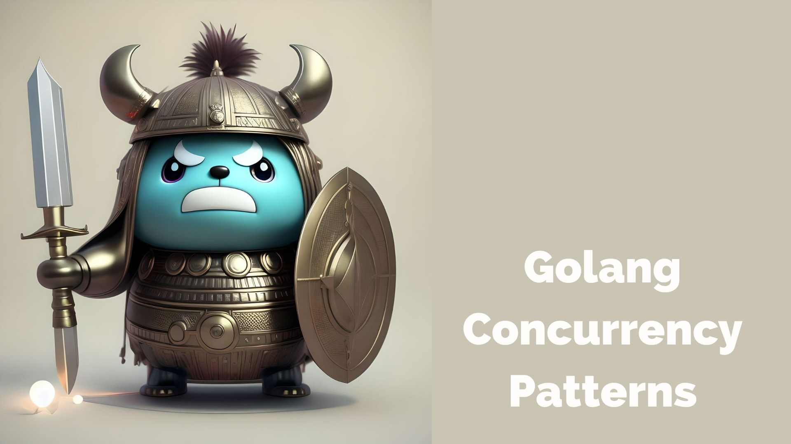

_Note:this repository is in under development some todo works like documentation, test cases, some new patterns will add in few days_

# Go Concurrency Patterns

Welcome to the Go Concurrency Patterns repository! This repository is a comprehensive collection of common concurrency patterns and techniques specifically designed for Go programming.

## Overview
Concurrency is a core feature of the Go programming language, and understanding how to effectively utilize it is essential for building efficient and scalable systems. This repository aims to provide you with a deep understanding of Go's concurrency primitives and demonstrate how to apply them through various patterns.

## Features

- Clear explanations and code examples for each concurrency pattern
- Best practices and guidelines for designing concurrent systems
- Easy-to-understand examples that demonstrate the power of Go's concurrency features
- Extensive coverage of popular patterns such as fan-out, fan-in, pipeline, worker pool, rendezvous, read-write locks, pub-sub, semaphores, and producer-consumer

## Getting Started

To get started with the Go Concurrency Patterns repository, follow these steps:

1. Clone the repository: git clone https://github.com/your-username/your-repository.git
2. Explore the patterns directory to find the pattern you're interested in.
3. Each pattern has its own dedicated folder with a README.md file explaining the pattern and providing code examples.
4. Read the pattern's README.md file to understand how it works and how to utilize it in your own projects.
5. Run the code examples and experiment with different scenarios to get hands-on experience with the patterns.

## Contributing

Contributions are welcome! If you have a new pattern to suggest or improvements to an existing pattern, please follow these steps:

1. Fork the repository.
2. Create a new branch: git checkout -b feature/my-new-pattern.
3. Make your changes and commit them: git commit -am 'Add new pattern: My New Pattern'.
4. Push the changes to your fork: git push origin feature/my-new-pattern.
5. Submit a pull request.

## Feedback

If you have any feedback, suggestions, or questions, please feel free to open an issue in the repository. We appreciate your input and strive to make this repository a valuable resource for the Go community.